# General documents

There are a few things I have to cover first.

- During the demo, I tried not to create too many commits because it would look like garbage, but that is only a limitation, not 100%. Testing is constantly changing until it is successful.

- When doing systems on AWS (which is most of the systems now), we will think about `well-architecture`. This is a model and recommendation given by AWS, I will try to explain what has been done around it.

- There is one factor that I always mention in any system that I work on, which is `security & cost`. These two things are very difficult to satisfy at the same time. Even my demo, I can easily create EKS in public subnet and connect to it without additional costs for services such as VPC Endpoint or Bastion instance. But that is not true in reality, I have been exposed to many systems and security is always important. On the contrary, for example, because of the high cost of installing a Blockchain node (the last time I installed a Rocket Pool node it cost almost $500 USD), I haven't been able to demo Ansible with it yet.

### Table of contents

- [1. List of documents](#1-list-of-documents)
- [2. System architecture](#2-system-architecture)
- [3. How does AWS Well-Architected meet?](#3-how-does-aws-well-architected-meet)
    - [3.1 Operational Excellence](#31-operational-excellence)
    - [3.2 Security](#32-security)
        - [3.2.1 Internet exposure layer](#321-internet-exposure-layer)
        - [3.2.2 Infrastructure layer](#322-infrastructure-layer)
        - [3.2.3 SIEM - Centralized Security Tools](#323-siem-centralized-security-tools)
        - [3.2.4 Scan apps](#324-scan-apps)
    - [3.3 Reliability](#33-reliability)
    - [3.4 Cost Optimization](#34-cost-optimization)
    - [3.5 Performance Efficiency](#35-performance-efficiency)
- [4. Q&A](#4-qa)

## 1. List of documents

In addition to this general document, you should read the documents given in the order in the following table. To understand the entire process of system setup and application deployment.

| No. | Document | Repository contains code |Notes |
| ------ | ------ | ------ | ------ |
| 1. | [terraform.md](./docs/terraform.md) | [dungpham91/devops.demo.terraform](https://github.com/dungpham91/devops.demo.terraform) | Documenting the details of automated infrastructure deployment using Terraform and Atlantis is the first step in the entire process. |
| 2. | [frontend.md](./docs/frontend.md) | [dungpham91/devops.demo.frontend](https://github.com/dungpham91/devops.demo.frontend) | See how to run a frontend app, scan it, build it, and push it to ECR so it's ready to deploy to an EKS cluster using ArgoCD. |
| 3. | [backend.md](./docs/backend.md) | [dungpham91/devops.demo.backend](https://github.com/dungpham91/devops.demo.backend) | See how to run a backend app, scan it, build it, and push it to ECR so it's ready to deploy to an EKS cluster using ArgoCD. |
| 4. | [argocd.md](./docs/argocd.md) | [dungpham91/devops.demo.argocd](https://github.com/dungpham91/devops.demo.argocd) | See how to install, setup, and deploy applications to an EKS cluster using ArgoCD, and what it looks like to adopt GitOps. |
| 5. | ansible.md | [dungpham91/devops.demo.ansible](https://github.com/dungpham91/devops.demo.ansible) | Coming soon!!! |

## 2. System architecture

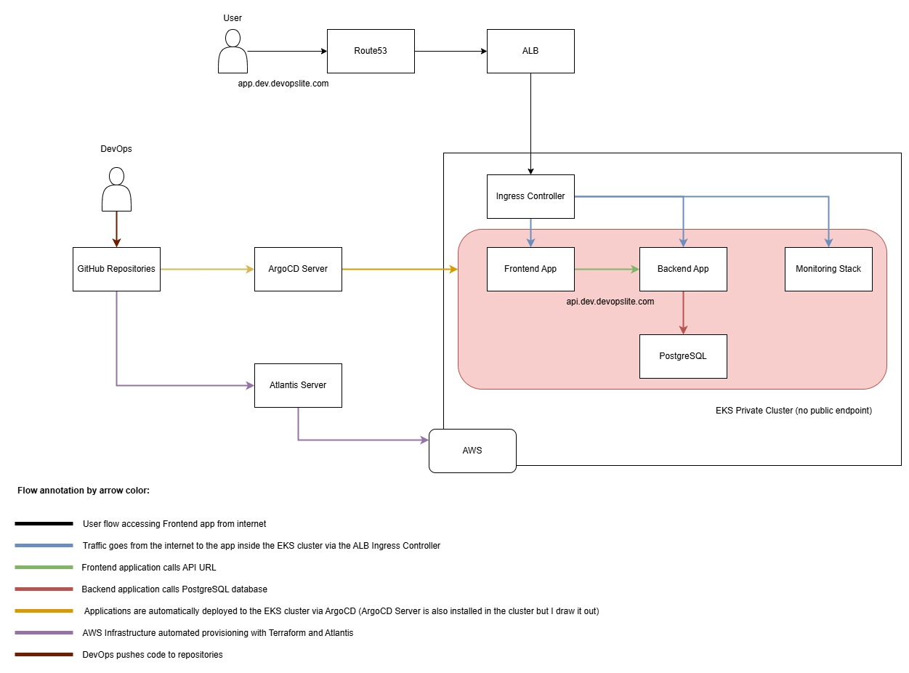

## 3. How does AWS Well-Architected meet?

I will summarize the five main pillars and how each of these pillars can be met by this system.

### 3.1 Operational Excellence

- **`Automation`**: I automated both the application and the infrastructure. How specifically?
    - Automate testing, scanning, building and pushing docker images to ECR using GitHub Actions.
    
    - Automate Terraform code with Atlantis. This is very important, it keeps the TF code consistent. Restrict the permissions of unnecessary IAM users/DevOps, limit users applying TF from local environments and no one controls.

    - Automatically deploy applications to EKS clusters using Helm and ArgoCD.

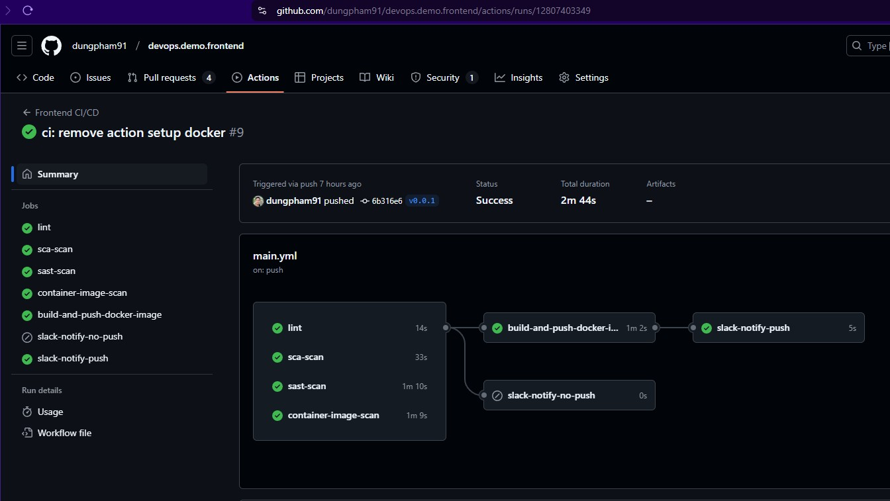

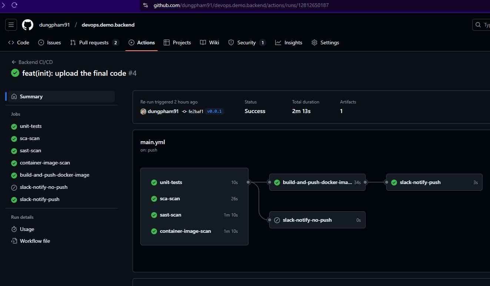

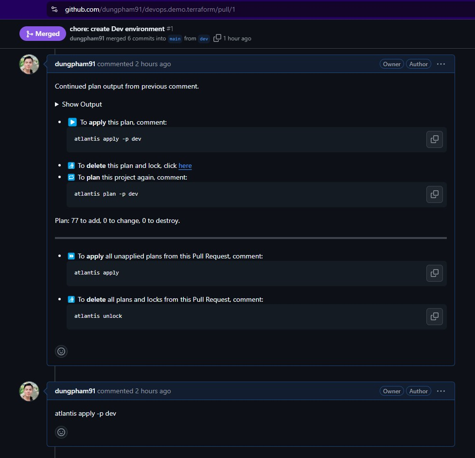

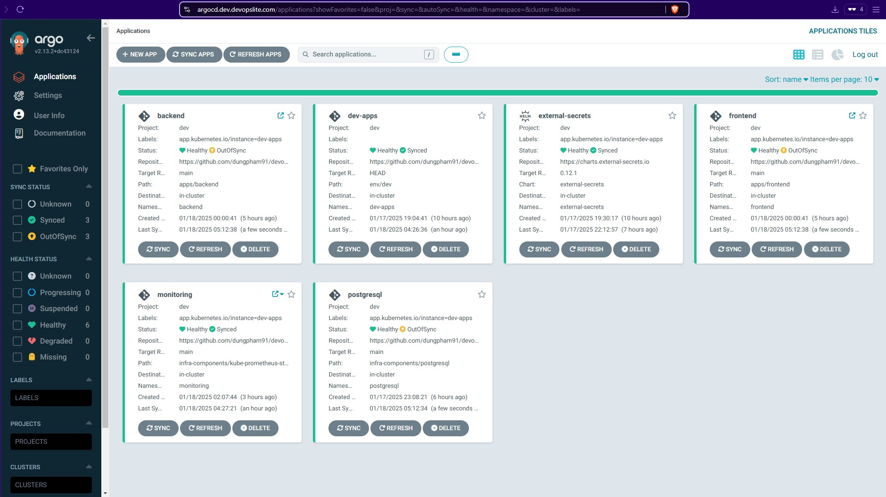

- **`Monitoring and alerts`**: 

In the scope of the demo, I have only installed the Prometheus-Grafana monitoring stack, created a custom alert rule and trigger to generate the alert case.

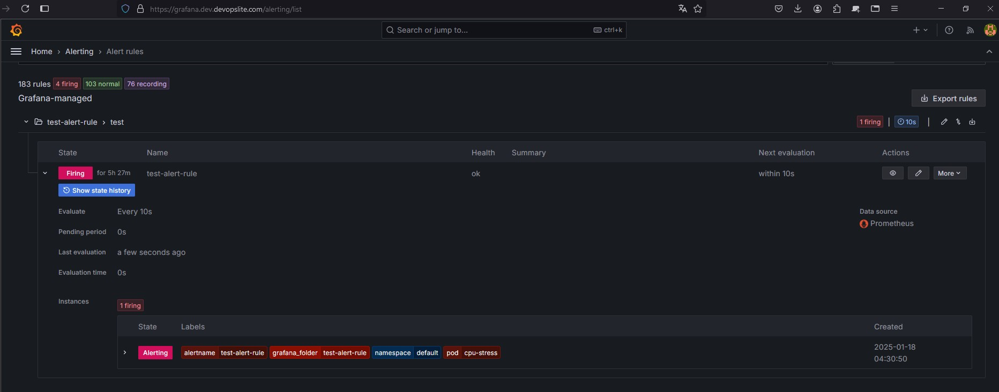

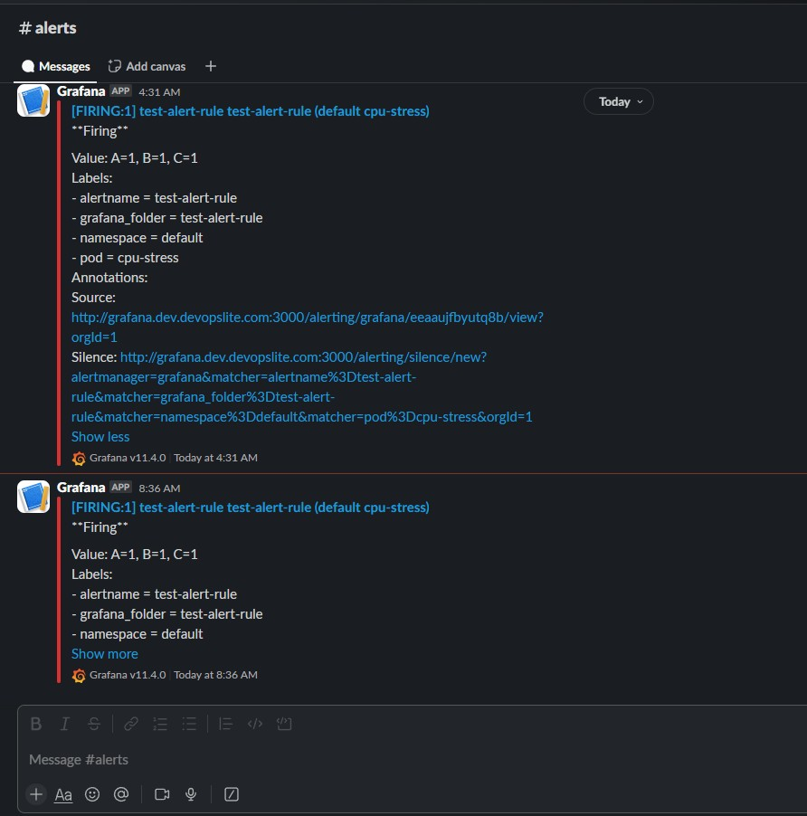

In fact, besides this monitoring stack, we will also install EFK or ELK stack (or other solutions) to collect logs from the entire system, analyze the problem more deeply. Combine with tracing solutions, such as Open Tracing.

But time does not allow and the cost of making a demo is not much. I just stop at this monitoring stack.

### 3.2 Security

Implementing security solutions will take time and money. Within the limits of this demo as well as a basic system that can be guaranteed to be safe, I will present it in an easy-to-understand way from the outer layer to the inner layer.

Some solutions I did (it's similar to this demo):

#### 3.2.1 Internet exposure layer

WAF and CDN (DDoS) are 2 solutions that I often use. On AWS, we can use WAF in front of ALB to prevent common layer 7 attacks such as XSS, SQL Injection...

As for CDN, there is Cloudfront on AWS but it doesn't seem to be as effective in terms of DDoS protection as Cloudflare. Personally, I usually use Cloudflare.

#### 3.2.2 Infrastructure layer

Some important points:

- All resources are created in private subnets, not exposing resources directly to the internet (except ALB). This makes it more difficult for hackers to scan the system.

- All resources are controlled with Security Group, we set it explicitly in Terraform code.

- All services communicate with each other through VPC Endpoints, not going out to the internet. This helps keep sensitive information safe, avoiding MITM attacks on the line.

For example, you can see that the Bastion instance is also in the private subnet.

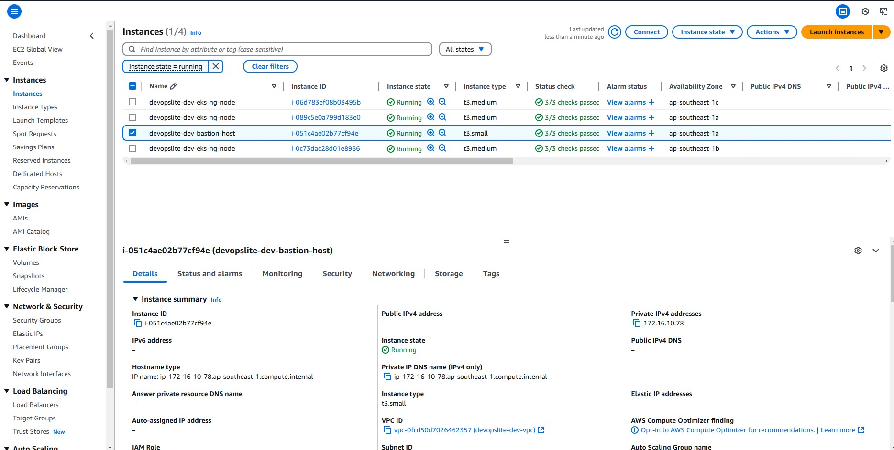

#### 3.2.3 SIEM - Centralized Security Tools

I have deployed Wazuh integrated with MISP as a comprehensive network security solution (at a reasonable cost). If possible, we can use Security Hub or more advanced solutions.

Therefore, in this demo, I used SIEM as a 3rd layer of defense, we will have more eyes and ears to know if the system is safe or not.

I will not present details about how to install or operate Wazuh. In the demo, I used Packer to create custom AMIs, these AMIs will be used to create EKS Worker Nodes.

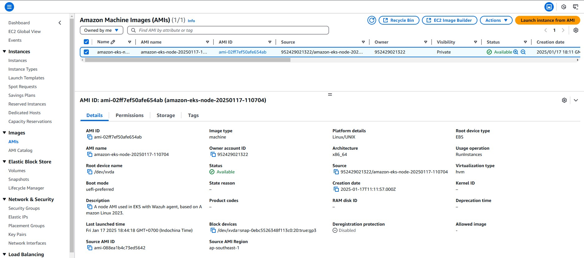

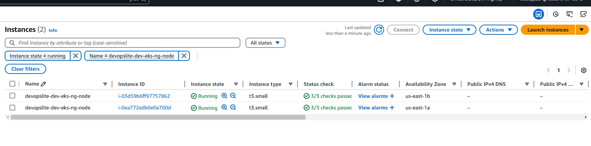

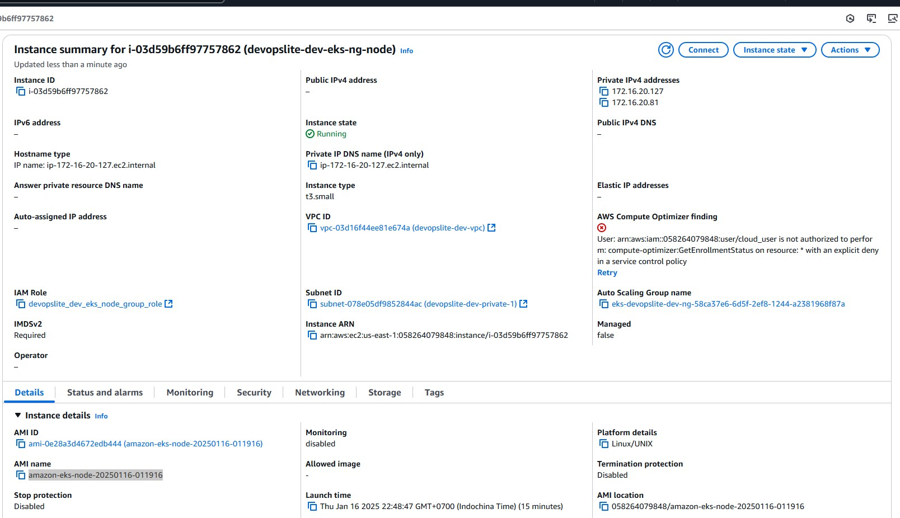

Each time the node is up, it will automatically connect to Wazuh Server. We do not need to do anything manually.

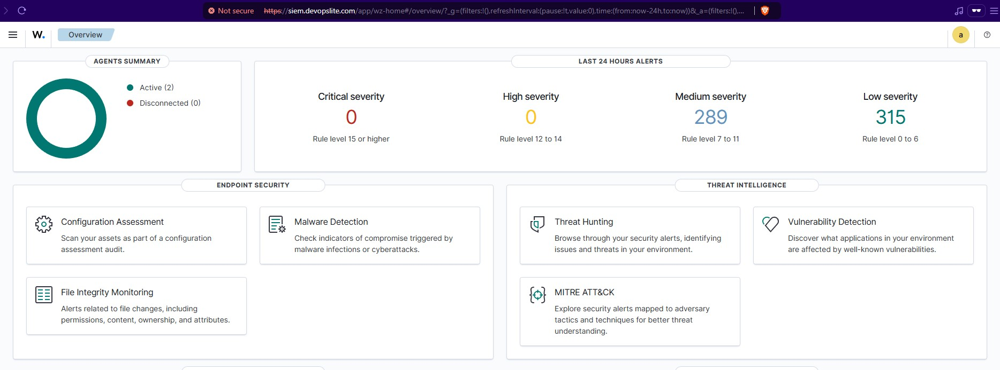

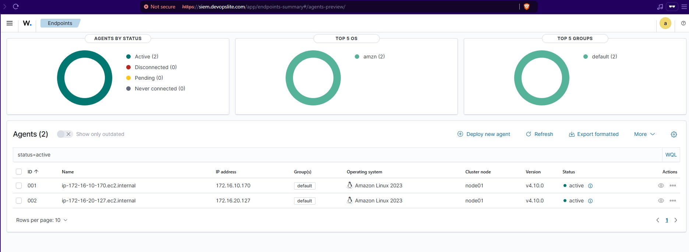

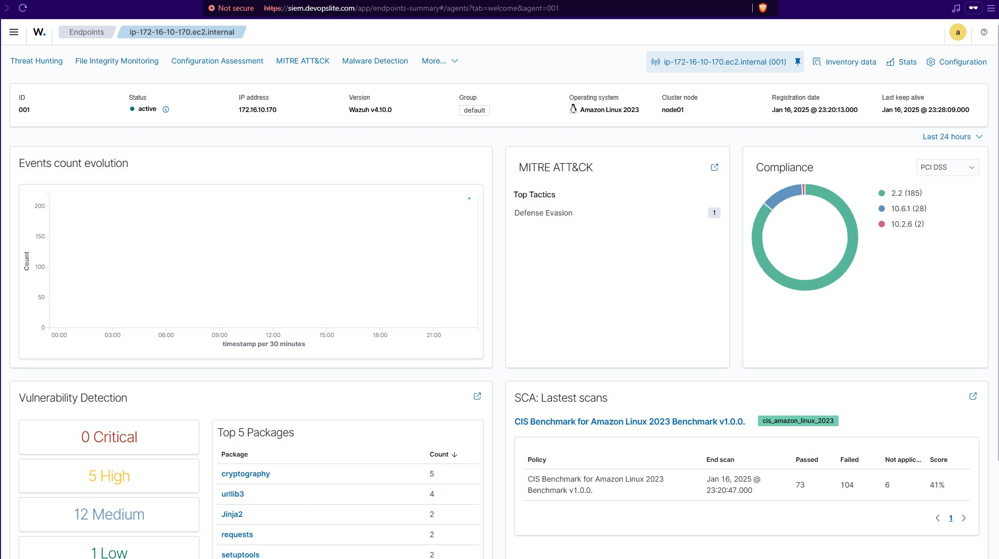

#### 3.2.4 Scan apps

I have applied scanning/testing tools to ensure the app is as secure as possible, with the best quality possible. After all, detecting security vulnerabilities before it is deployed to the system is still the best.

List of scans I have applied:

- **`Lint`** to check frontend app syntax.

- **`Unit Tests`** to check backend app functionality.

- **`SCA scan with Synk`** to ensure safe libraries

- **`SAST scan with CodeQL`** to ensure good code quality (we often use SonarQube here)

- **`Container image scan with Trivy`** to ensure Docker images of built apps are free of security vulnerabilities before pushing to ECR.

- **`Scan IaC with Checkov`** to ensure Terraform code will not create vulnerable resources. This is a safety net for the infrastructure.

Basically, we have enough layers of protection here:

- Communication layer with internet users
- Infrastructure layer
- Security monitoring layer
- Application layer (code)

Besides, we can add more solutions such as site-2-site VPN, dividing multiple VPCs by features, using SSM to access resources (I am using), tunnel services such as Cloudflare Zero Trust, Azure AD,...

### 3.3 Reliability
The best context we have is multi cloud and multi region. However, not every organization has the conditions to do that.

Even in this demo, although I used limited resources, it still cost money in just a short time. With the automatic creation and deletion of resources like EKS, ECS, the cost has also increased.

I will review what was applied to the demo:

- Use 1 VPC for all resources. In principle, we will need a VPC app, VPC database, VPC admin (used for administration, security). But it will increase the cost when having to peer or use a transit gateway between VPCs.

- I used the maximum 3 zones in the Singapre region and spread the resources evenly across them. At least in 1 region I am still safe, unless the whole Singapre region collapses (which is rare but still possible).

- I have set up auto scaling for EKS Node Group on all zones.

- I have also set up auto scaling for apps inside the EKS cluster using HPA and set up podAntiAffinity so that pods are not on the same node. Avoid the case where pods are on the same node, if the node dies, the app dies too.

### 3.4 Cost Optimization

To the best of my ability, I have tried to do the following to reduce costs as much as possible.

- Using IaC to deploy resources will reduce the number of resources that are mistakenly created or unused.

- Use the smallest possible sites, from t3.micro onwards, and gradually increase until reaching the resource limit. The principle is from small, gradually increase to large according to the level of monitoring.

- Set resource limits for Apps deployed to EKS, to avoid increasing CPU/RAM beyond the threshold, suddenly causing the cluster to automatically scale up.

- The best case scenario is that we can use EC2 Reserved to save costs. Previously, I also bid Spot instance but waited too long without resources, so I had to set up EKS cluster using On Demand.

- Tag possible resources, from which they can use Kubecost or Tag Editor or Cost Explorer to check costs by application/project/environment.

### 3.5 Performance Efficiency
Basically, the system is built on AWS services so there won't be too much to say here about it.

## 4. Q&A

I summarize the answers to the scenarios.

