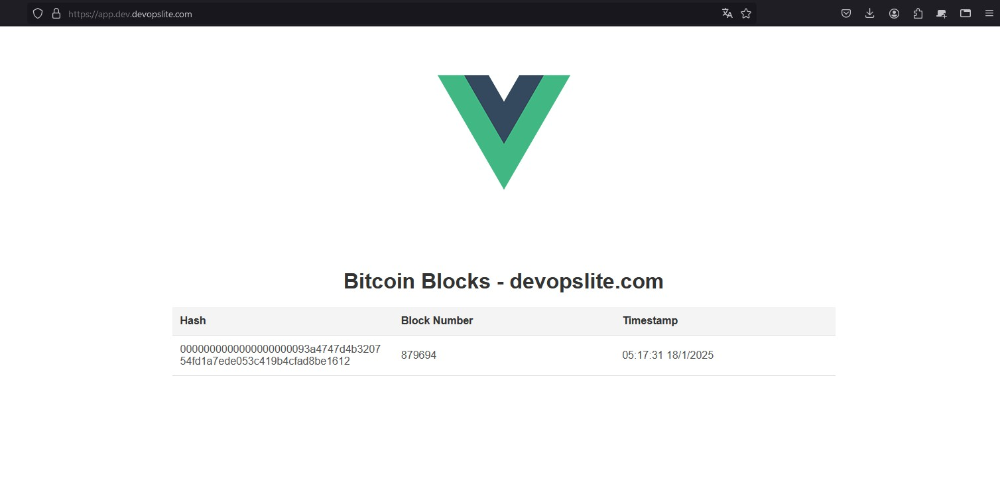
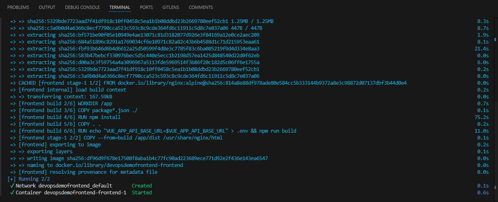
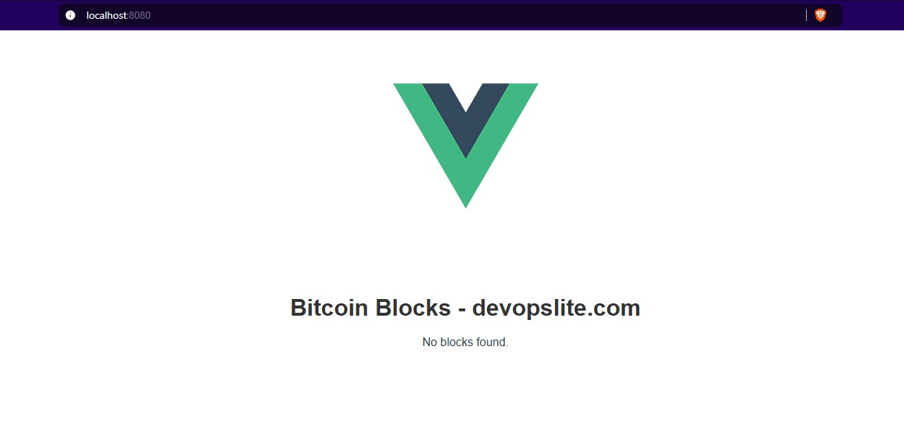
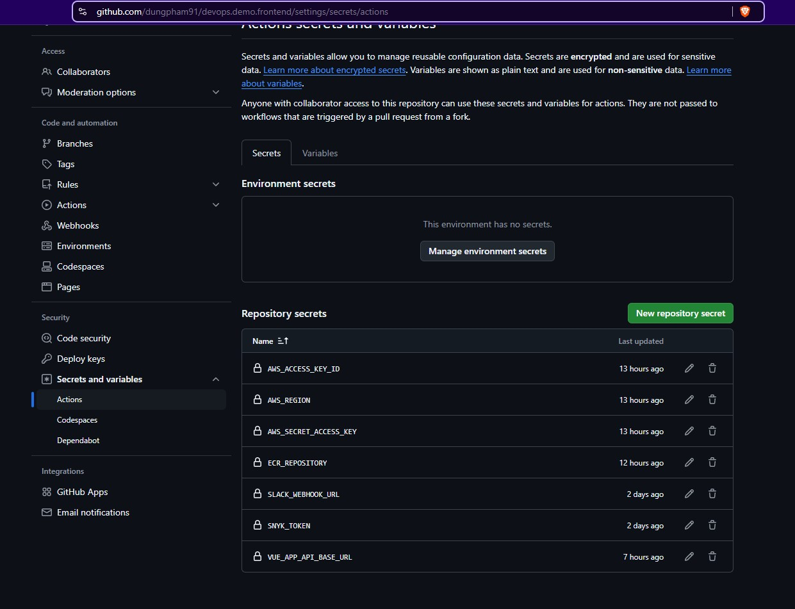
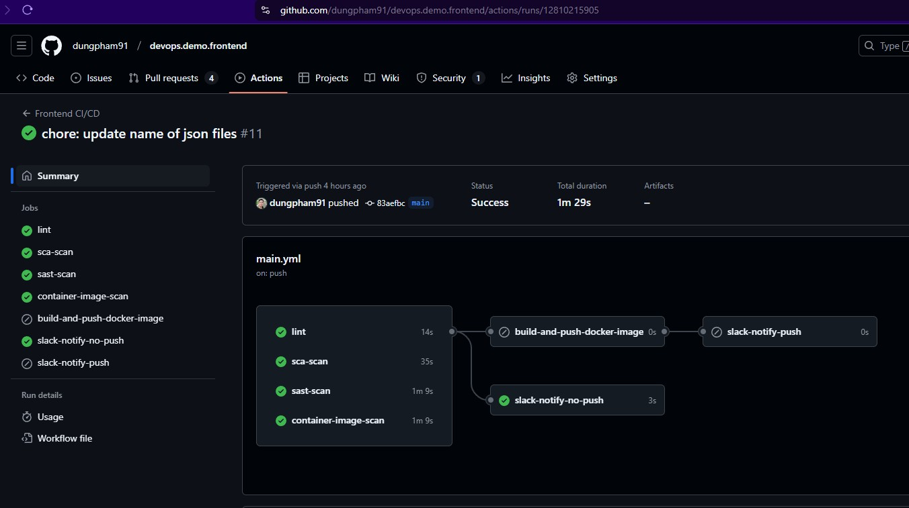
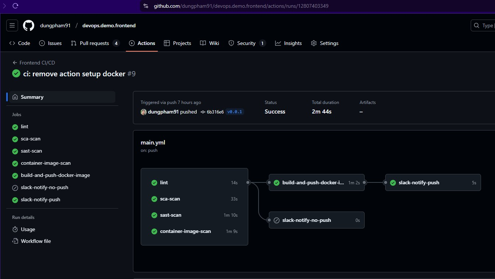
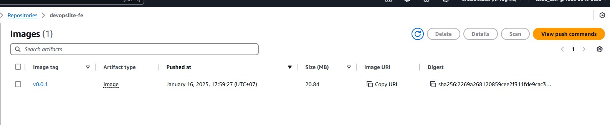
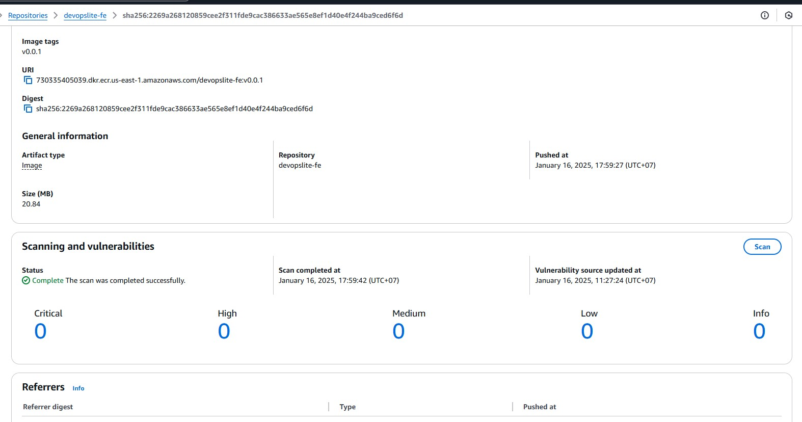

# [Frontend](https://github.com/dungpham91/devops.demo.frontend)



Frontend application written by me in Vue.js to display the latest block value of BTC token.

> Please note that I am not a frontend, backend or fullstack expert. I just google and do it.

### Table of contents

- [1. Use in local environment](#1-use-in-local-environment)
- [2. Automatically build and push to ECR with GitHub Actions](#2-automatically-build-and-push-to-ecr-with-github-actions)
  - [2.1 Update secrets for GitHub Actions](#21-update-secrets-for-github-actions)
  - [2.2 GHA workflow explained](#22-gha-workflow-explained)

How to use this application?

## 1. Use in local environment

To use this application, you will need to install Docker (or Docker Desktop if you are using Windows + WSL) and Nodejs, NPM.

You can easily google how to install the above tools.

Now run the following command to run the app:

```sh
docker-compose up -d
```

Your terminal will look like this.



Then, you access the address http://localhost:8080 on your browser and the app will appear as below.



At this time, it will display `No blocks found` but that's okay, because you still need to start the [Backend](https://github.com/dungpham91/devops.demo.backend).

Once you're done working locally, you can turn compose down.

```sh
docker-compose down
```

## 2. Automatically build and push to ECR with GitHub Actions

The app is set up to automatically build and push to private ECR with GitHub Actions. You can see the [workflow file here](https://github.com/dungpham91/devops.demo.frontend/blob/main/.github/workflows/main.yml).

> An important note is that you should only create tags to push images to ECR, after [Terraform](https://github.com/dungpham91/devops.demo.terraform) has finished creating the infrastructure. Because if you push images without ECR, it will fail.

### 2.1 Update secrets for GitHub Actions

You will need to update the values ​​for the GitHub Actions secrets as shown in the image below.



There are 3 values ​​to note:

- **`AWS_REGION`**: Region where you are creating the system, for example `ap-southeast-1`.

- **`ECR_REPOSITORY`**: The URI of the ECR frontend repository, which is in the form `xxxxxxxxxxxx.dkr.ecr.ap-southeast-1.amazonaws.com/devopslite-fe` where `xxxxxxxxxxxx` is the 12-digit ID of your AWS account.

- **`VUE_APP_API_BASE_URL`**: The URL of the backend application, for example `https://api.dev.devopslite.com`.

### 2.2 GHA workflow explained

Workflow is divided into 2 main streams:

- PRs or commits directly to the main branch will perform job scans and then send notifications to Slack.



- Tags created in the format `vXX.XX.XX` (e.g. `v0.0.1` or `v.1.10.1`) will perform job scans, then build Docker images, push to private ECR repositories, and finally send notifications to Slack.



After GHA finishes running, you can go to ECR to check the uploaded image.





The frontend app will perform the following scans to ensure security.

- **`Lint`**: Check code for syntax violations

- **`SCA scan with Snyk`**: Scanning libraries as well as static code, Snyk can be used for many purposes, even SAST.

- **`SAST scan with CodeQL`**: I use CodeQL in addition to Snyk for SAST scanning, ensuring results when running through different tools, detecting security vulnerabilities better.

- **`Container image scan with Trivy`**: I use Trivy to scan Docker images for security vulnerabilities before pushing them to ECR.

Once the image is pushed to ECR, it will be placed on the [Helm chart](https://github.com/dungpham91/devops.demo.argocd/tree/main/apps/frontend) and automatically deployed to the [EKS cluster using ArgoCD](https://github.com/dungpham91/devops.demo.argocd/blob/main/env/dev/templates/frontend.yaml).
