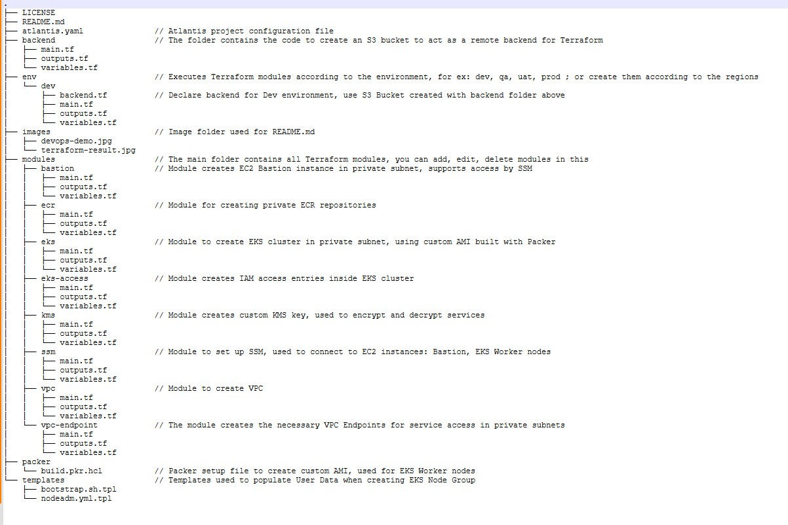
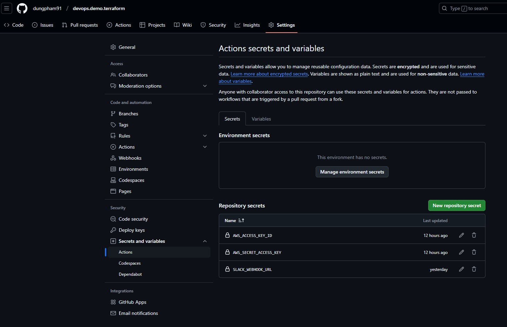
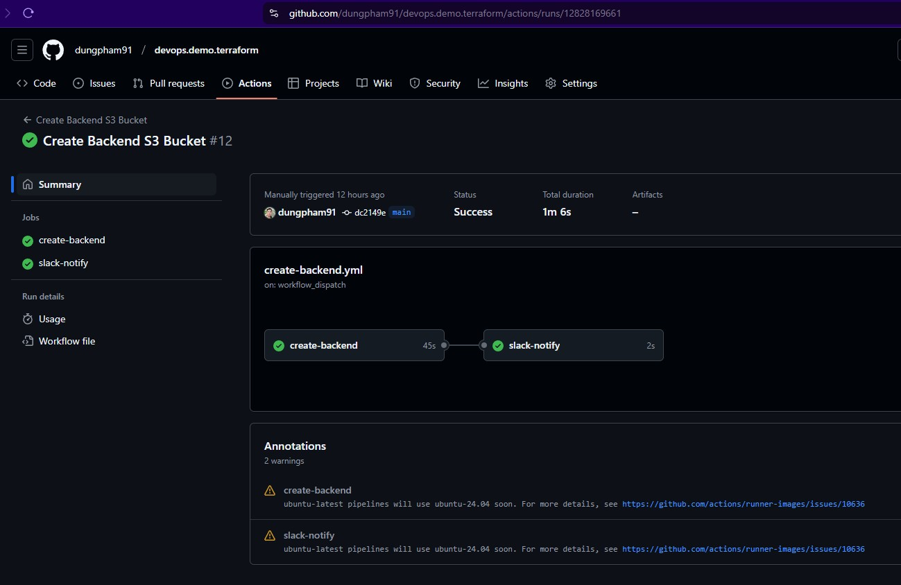
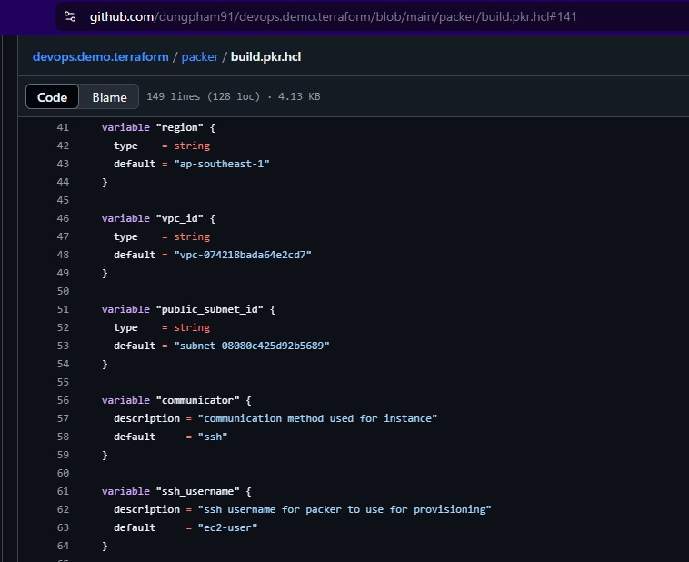
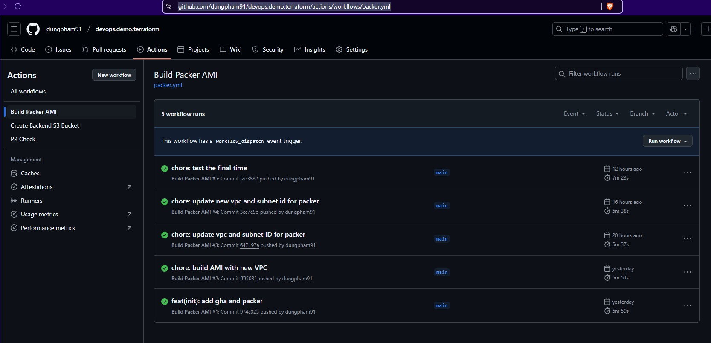
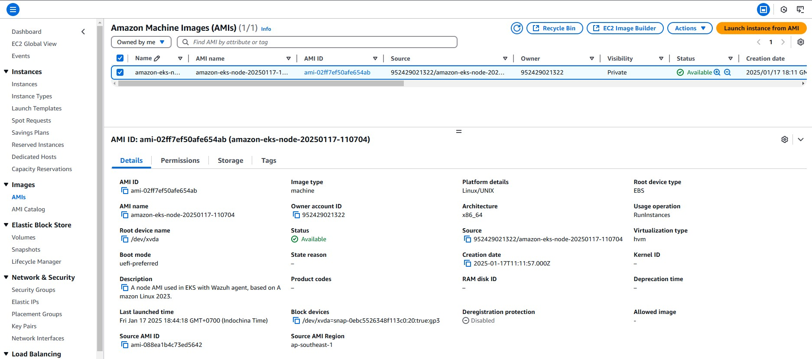
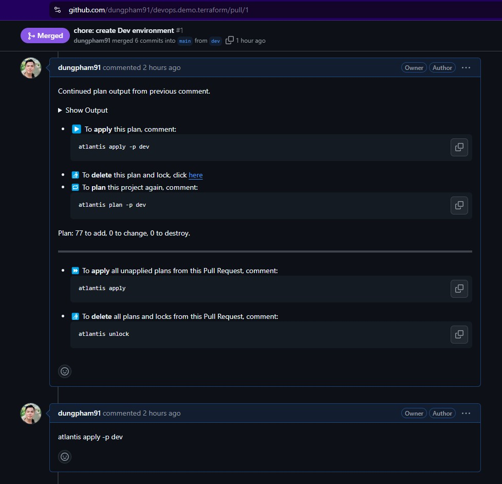
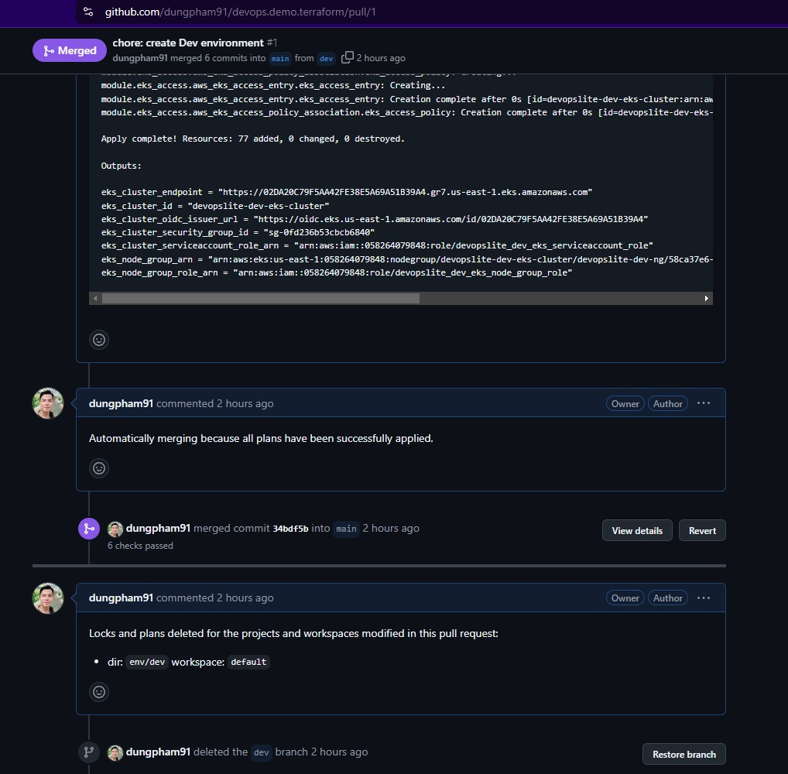

# [Terraform](https://github.com/dungpham91/devops.demo.terraform)

This repository is used to:

- Automatically build custom AMI using Packer, automatic flow using GitHub Action.

- Create an S3 bucket to act as a remote backend for all Terraform code.

- Create a VPC in Singapore with 3 public subnets and 3 private subnets.

- Create the necessary VPC Endpoints for the services, so that they can communicate with each other through private subnets without going out to the internet.

- Create custom KMS keys to encrypt and decrypt services on AWS

- Create 2 private ECR repositories to store Docker images of Frontend and Backend applications.

- Create 1 EKS cluster with private endpoint, no public endpoint. Create Worker Node Group with AMI built with Docker.

- Create IAM access entries inside EKS cluster, after creating EKS cluster, we can assign IAMs to have access to resources in the cluster.

### Table of contents

- [1. Structure of the repository](#1-structure-of-the-repository)
- [2. How to use this repository](#2-how-to-use-this-repository)
  - [2.1 Add GitHub Actions secrets](#21-add-github-actions-secrets)
  - [2.2 Run workflow to create S3 bucket for remote backend](#22-run-workflow-to-create-s3-bucket-for-remote-backend)
  - [2.3 Create custom AMI using Packer](#23-create-custom-ami-using-packer)
    - [2.3.1 Update VPC ID and Public subnet for Packer](#231-update-vpc-id-and-public-subnet-for-packer)
    - [2.3.2 GitHub action automatically triggers Packer build](#232-github-action-automatically-triggers-packer-build)
  - [2.4 Create PR and apply Terraform with Atlantis](#24-create-pr-and-apply-terraform-with-atlantis)
- [3. Clean up](#3-clean-up)

## 1. Structure of the repository

Below is an explanation of the directories and files contained in the repository.



## 2. How to use this repository

By default, you already know how to use the AWS CLI and Terraform. If you don't know, check out the information on the AWS and Terraform homepages.

### 2.1 Add GitHub Actions secrets

First, you need to create the following GitHub Actions secrets. Basically, we just need `AWS_ACCESS_KEY_ID` and `AWS_SECRET_ACCESS_KEY`. If you don't use Slack notifications, you can leave them out of the GitHub Actions flows in this Terraform repository.

Note that these IAM credentials should have Administrator privileges or sufficient privileges to create the required services on AWS.



### 2.2 Run workflow to create S3 bucket for remote backend

Now, you click on the [workflow](https://github.com/dungpham91/devops.demo.terraform/actions/workflows/create-backend.yml) to **`trigger it manually`**, the purpose is to use GitHub Actions to execute the code in the backend folder first.

We need to do this first before applying any other Terraform modules, because remote backend is a mandatory requirement when using Atlantis.

> An important note when performing this step, you need to check all the values ​​inside the [backend](https://github.com/dungpham91/devops.demo.terraform/tree/main/backend) directory carefully, see if it matches any existing resources on AWS, especially the name of the S3 bucket. Because if it matches, the workflow execution will fail, or execute partially and fail. At this time, you will have to manually delete the `S3 bucket`, `KMS key`, `KMS alias` and `DynamoDB table` because this workflow is being created in the middle. Then execute again.



### 2.3 Create custom AMI using Packer

Next, you will need to create a custom AMI to use when creating an EKS cluster, specifically creating Worker Nodes.

Why do we need to create an AMI? Because it has the Wazuh Agent pre-installed and connects to the Wazuh server (the address I used for the demo is https://siem.devopslite.com).

You can change the Wazuh server address to your own in [this line](https://github.com/dungpham91/devops.demo.terraform/blob/main/packer/build.pkr.hcl#L141).

If you don't want to create a custom AMI, you can skip this step and use the AWS default AMI (e.g. AL2023).

#### 2.3.1 Update VPC ID and Public subnet for Packer

Normally, each AWS region will have a default VPC, you can use this VPC for Packer.

In case your AWS region does not have any VPC, you can go to the console and manually create a VPC with a single public subnet, this only takes about 1 minute. AWS automatically sets everything up for you. Once you're done, you can delete this temporary VPC immediately.

Then, get the VPC ID and Public subnet ID to update these 2 lines.

https://github.com/dungpham91/devops.demo.terraform/blob/main/packer/build.pkr.hcl#L48

https://github.com/dungpham91/devops.demo.terraform/blob/main/packer/build.pkr.hcl#L53



#### 2.3.2 GitHub action automatically triggers Packer build

After changing the 2 values, you commit to the main branch, now GitHub Actions will automatically trigger the AMI build using Packer. You will not have to do anything else in this step.

The thing you need to note is whether you have added IAM credentials to the GitHub Actions secret before. Otherwise, the workflow will fail.



Once the GHA (I'm referring to GitHub Actions) is done executing, get the ID of the AMI to use for the next step.



### 2.4 Create PR and apply Terraform with Atlantis

Here, I assume that you already know how to use Atlantis so I will not tell you how to install it and how to connect to the GitHub repository. You can learn more from the Atlantis homepage.

Because Atlantis is effective when running `terraform plan` and `terraform apply` commands on [PRs](https://github.com/dungpham91/devops.demo.terraform/pulls?q=is%3Apr+is%3Aclosed). So, you checkout a branch from the `main` branch, for example create a `dev` branch.

Then you update the AMI ID that was just built in the above step into the [`variables.tf`](https://github.com/dungpham91/devops.demo.terraform/blob/main/env/dev/variables.tf#L33) of the environment to deploy.


Next, you create a PR from the `dev` branch to the `main` branch, at this time Atlantis will automatically do the rest.

It will automatically run the plan and display the output for you to see what resources have been changed.



If it is ok, you just comment with the command apply atlantis, for example here I comment `atlantis apply -p dev`

After Atlantis applies the changes from the PR to the environment, it will automatically merge the PR into the main branch.



## 3. Clean up

To delete an AWS environment you created, do the following.

You create a new PR and the content is to comment all the modules in file https://github.com/dungpham91/devops.demo.terraform/blob/main/env/dev/main.tf, you don't need to delete the code in the repository, you just need to comment it out, Atlantis will automatically understand to destroy the resources.

The next step is to delete the S3 bucket used as the remote backend, this step needs to be done on your local computer.

Go to the [backend](https://github.com/dungpham91/devops.demo.terraform/tree/main/backend) folder, run the following commands in turn to transfer the state from the S3 bucket to your computer.

```sh
rm -rf .terraform
terraform init
terraform state pull > terraform.tfstate
```

Then open the [backend/main.tf](https://github.com/dungpham91/devops.demo.terraform/blob/main/backend/main.tf) file and comment `lines 9-15`.

Then delete all resources related to the S3 bucket, including DynamoDB.

```sh
terraform destroy
```